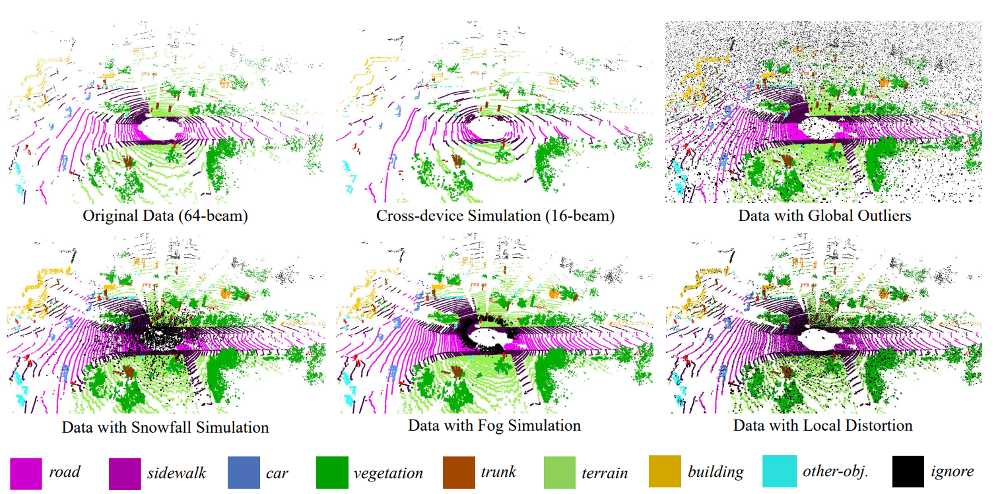
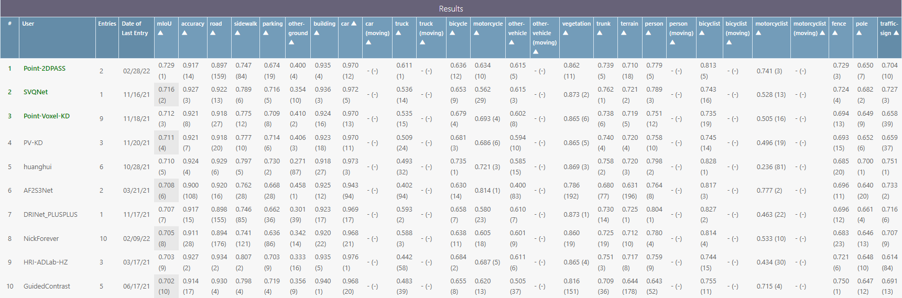
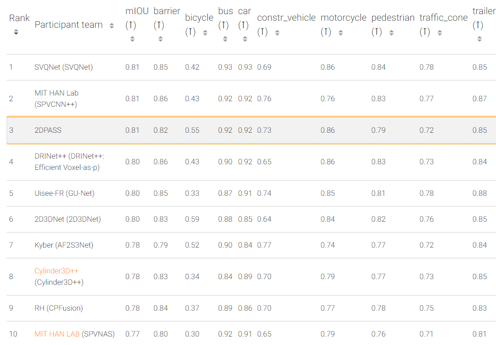

[](https://paperswithcode.com/sota/3d-semantic-segmentation-on-semantickitti?p=2dpass-2d-priors-assisted-semantic)[](https://paperswithcode.com/sota/lidar-semantic-segmentation-on-nuscenes?p=2dpass-2d-priors-assisted-semantic)

# 2DPASS

[](https://arxiv.org/pdf/2207.04397.pdf)
[](https://github.com/yanx27/2DPASS)


This repository is for **2DPASS** introduced in the following paper

[Xu Yan*](https://yanx27.github.io/), [Jiantao Gao*](https://github.com/Gao-JT), [Chaoda Zheng*](https://github.com/Ghostish), Chao Zheng, Ruimao Zhang, Shuguang Cui, [Zhen Li*](https://mypage.cuhk.edu.cn/academics/lizhen/), "*2DPASS: 2D Priors Assisted Semantic Segmentation on LiDAR Point Clouds*", ECCV 2022 [[arxiv]](https://arxiv.org/pdf/2207.04397.pdf).
 

If you find our work useful in your research, please consider citing:
```latex
@inproceedings{yan20222dpass,
  title={2dpass: 2d priors assisted semantic segmentation on lidar point clouds},
  author={Yan, Xu and Gao, Jiantao and Zheng, Chaoda and Zheng, Chao and Zhang, Ruimao and Cui, Shuguang and Li, Zhen},
  booktitle={European Conference on Computer Vision},
  pages={677--695},
  year={2022},
  organization={Springer}
}

@InProceedings{yan2022let,
      title={Let Images Give You More: Point Cloud Cross-Modal Training for Shape Analysis}, 
      author={Xu Yan and Heshen Zhan and Chaoda Zheng and Jiantao Gao and Ruimao Zhang and Shuguang Cui and Zhen Li},
      year={2022},
      booktitle={NeurIPS}
}

@article{yan2023benchmarking,
  title={Benchmarking the Robustness of LiDAR Semantic Segmentation Models},
  author={Yan, Xu and Zheng, Chaoda and Li, Zhen and Cui, Shuguang and Dai, Dengxin},
  journal={arXiv preprint arXiv:2301.00970},
  year={2023}
}
```
## News
* **2023-04-01** We merge MinkowskiNet and official SPVCNN models from [SPVNAS](https://github.com/mit-han-lab/spvnas) in our codebase. You can check these models in `config/`. We rename our baseline model from `spvcnn.py` to `baseline.py`.
* **2023-03-31** We provide codes for the robustness evaluation on SemanticKITTI-C.
* **2023-03-27** We release a model with higher performance on SemanticKITTI and codes for naive instance augmentation.
* **2023-02-25** We release a new robustness benchmark for LiDAR semantic segmentation at [SemanticKITTI-C](https://yanx27.github.io/RobustLidarSeg/). Welcome to test your models!
<p align="center">
    
</p>


* **2022-10-11** Our new work for cross-modal knowledge distillation is accepted at NeurIPS 2022:smiley: [paper](https://arxiv.org/pdf/2210.04208.pdf) / [code](https://github.com/ZhanHeshen/PointCMT).
* **2022-09-20** We release codes for SemanticKITTI single-scan and NuScenes :rocket:!
* **2022-07-03** 2DPASS is accepted at **ECCV 2022** :fire:!
* **2022-03-08** We achieve **1st** place in both single and multi-scans of [SemanticKITTI](http://semantic-kitti.org/index.html) and **3rd** place on [NuScenes-lidarseg](https://www.nuscenes.org/) :fire:! 
<p align="center">
    
</p>
<p align="center">
    
</p>
<p align="center">
    
</p>

## Installation

### Requirements
- pytorch >= 1.8 
- yaml
- easydict
- pyquaternion
- [lightning](https://github.com/Lightning-AI/lightning) (tested with pytorch_lightning==1.3.8 and torchmetrics==0.5)
- [torch-scatter](https://github.com/rusty1s/pytorch_scatter) (pip install torch-scatter -f https://data.pyg.org/whl/torch-1.9.0+${CUDA}.html)
- [nuScenes-devkit](https://github.com/nutonomy/nuscenes-devkit) (optional for nuScenes)
- [spconv](https://github.com/traveller59/spconv) (tested with spconv==2.1.16 and cuda==11.1, pip install spconv-cu111==2.1.16)
- [torchsparse](https://github.com/mit-han-lab/torchsparse) (optional for MinkowskiNet and SPVCNN. sudo apt-get install libsparsehash-dev, pip install --upgrade git+https://github.com/mit-han-lab/torchsparse.git@v1.4.0)

## Data Preparation

### SemanticKITTI
Please download the files from the [SemanticKITTI website](http://semantic-kitti.org/dataset.html) and additionally the [color data](http://www.cvlibs.net/download.php?file=data_odometry_color.zip) from the [Kitti Odometry website](http://www.cvlibs.net/datasets/kitti/eval_odometry.php). Extract everything into the same folder.
```
./dataset/
├── 
├── ...
└── SemanticKitti/
    ├──sequences
        ├── 00/           
        │   ├── velodyne/	
        |   |	├── 000000.bin
        |   |	├── 000001.bin
        |   |	└── ...
        │   └── labels/ 
        |   |   ├── 000000.label
        |   |   ├── 000001.label
        |   |   └── ...
        |   └── image_2/ 
        |   |   ├── 000000.png
        |   |   ├── 000001.png
        |   |   └── ...
        |   calib.txt
        ├── 08/ # for validation
        ├── 11/ # 11-21 for testing
        └── 21/
	    └── ...
```

### NuScenes
Please download the Full dataset (v1.0) from the [NuScenes website](https://www.nuscenes.org/) with lidarseg and extract it.
```
./dataset/
├── 
├── ...
└── nuscenes/
    ├──v1.0-trainval
    ├──v1.0-test
    ├──samples
    ├──sweeps
    ├──maps
    ├──lidarseg
```

## Training
### SemanticKITTI
You can run the training with
```shell script
cd <root dir of this repo>
python main.py --log_dir 2DPASS_semkitti --config config/2DPASS-semantickitti.yaml --gpu 0
```
The output will be written to `logs/SemanticKITTI/2DPASS_semkitti` by default. 
### NuScenes
```shell script
cd <root dir of this repo>
python main.py --log_dir 2DPASS_nusc --config config/2DPASS-nuscenese.yaml --gpu 0 1 2 3
```

### Vanilla Training without 2DPASS
We take SemanticKITTI as an example.
```shell script
cd <root dir of this repo>
python main.py --log_dir baseline_semkitti --config config/2DPASS-semantickitti.yaml --gpu 0 --baseline_only
```

## Testing
You can run the testing with
```shell script
cd <root dir of this repo>
python main.py --config config/2DPASS-semantickitti.yaml --gpu 0 --test --num_vote 12 --checkpoint <dir for the pytorch checkpoint>
```
Here, `num_vote` is the number of views for the test-time-augmentation (TTA). We set this value to 12 as default (on a Tesla-V100 GPU), and if you use other GPUs with smaller memory, you can choose a smaller value. `num_vote=1` denotes there is no TTA used, and will cause about ~2\% performance drop.

## Robustness Evaluation
Please download all subsets of [SemanticKITTI-C](https://arxiv.org/pdf/2301.00970.pdf) from [this link](https://cuhko365-my.sharepoint.com/personal/218012048_link_cuhk_edu_cn/_layouts/15/onedrive.aspx?id=%2Fpersonal%2F218012048%5Flink%5Fcuhk%5Fedu%5Fcn%2FDocuments%2FSemanticKITTIC&ga=1) and extract them.
```
./dataset/
├── 
├── ...
└── SemanticKitti/
    ├──sequences
    ├──SemanticKITTI-C
        ├── clean_data/           
        ├── dense_16beam/           
        │   ├── velodyne/	
        |   |	├── 000000.bin
        |   |	├── 000001.bin
        |   |	└── ...
        │   └── labels/ 
        |   |   ├── 000000.label
        |   |   ├── 000001.label
        |   |   └── ...
	    ...
```
You can run the robustness evaluation with
```shell script
cd <root dir of this repo>
python robust_test.py --config config/2DPASS-semantickitti.yaml --gpu 0  --num_vote 12 --checkpoint <dir for the pytorch checkpoint>
```

## Model Zoo
You can download the models with the scores below from [this Google drive folder](https://drive.google.com/drive/folders/1Xy6p_h827lv8J-2iZU8T6SLFkxfoXPBE?usp=sharing).
### SemanticKITTI
|Model (validation)|mIoU (vanilla)|mIoU (TTA)|Parameters|
|:---:|:---:|:---:|:---:|
|MinkowskiNet|65.1%|67.1%|21.7M|
|SPVCNN|65.9%|67.8%|21.8M|
|2DPASS (4scale-64dimension)|68.7%|70.0%|1.9M|
|2DPASS (6scale-256dimension)|70.7%|72.0%|45.6M|

Here, we fine-tune 2DPASS models on SemanticKITTI with more epochs and thus gain the higher mIoU. If you train with 64 epochs, it should be gained about 66%/69% for vanilla and 69%/71% after TTA.

### NuScenes
|Model (validation)|mIoU (vanilla)|mIoU (TTA)|Parameters|
|:---:|:---:|:---:|:---:|
|MinkowskiNet|74.3%|76.0%|21.7M|
|SPVCNN|74.9%|76.9%|21.8M|
|2DPASS (6scale-128dimension)|76.7%|79.6%|11.5M|
|2DPASS (6scale-256dimension)|78.0%|80.5%|45.6M|

**Note that the results on benchmarks are gained by training with additional validation set and using instance-level augmentation.**

## Acknowledgements
Code is built based on [SPVNAS](https://github.com/mit-han-lab/spvnas), [Cylinder3D](https://github.com/xinge008/Cylinder3D), [xMUDA](https://github.com/valeoai/xmuda) and [SPCONV](https://github.com/traveller59/spconv).

## License
This repository is released under MIT License (see LICENSE file for details).


